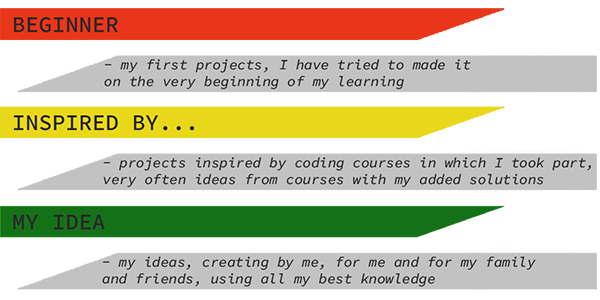
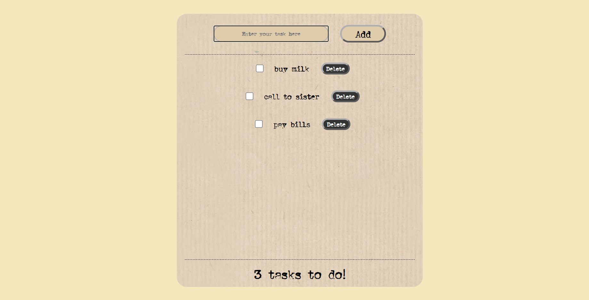

# Retrofabryka---new
> Simple TODO app

## Table of contents
* [Colors key](#colors-key)
* [General info](#general-info)
* [Screenshots](#screenshots)
* [Technologies](#technologies)
* [Features](#features)
* [Inspiration](#inspiration)
* [Contact](#contact)

## Colors-key

## General info

I read that every programmer have to do own "TODO App" so after I finished Harvard Course - "CS50's Web Programming with Python and JavaScript", I decided to do my.

TODO app uses DOMPurify - sanitizer (https://github.com/cure53/DOMPurify). And saves all task to localstorage, so through the next visit on the page ale tasks are uploded.

## Screenshots

### Main view

## Technologies
* HTML
* CSS
* Javascript
* SCSS
* Lightbox library

## Features

Live demo https://przemek-szadkowski.github.io/my_todo_app/

## Status
Project is: finished

## Inspiration
Project inspired by internet and Harvard Course - "CS50's Web Programming with Python and JavaScript"

## Contact
Created by [przemoszadkowski@o2.pl](mailto:user@example.com) - feel free to contact me!

